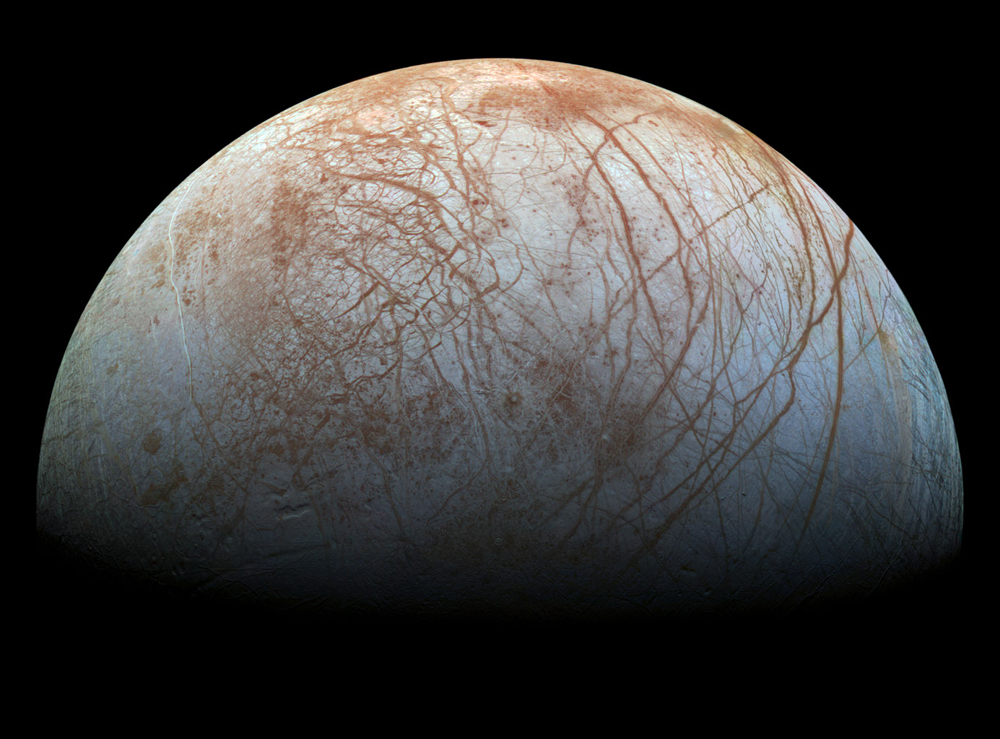

# surface-manifestation-of-melting-withing-the-ice-shell-of-europa

Master thesis at the Faculty of Mathematics and Physics, Charles University in Prague (In progress)

The aim is to model the process of generation of chaotic terrains at the surface of Jupiter's moon Europa. Finite elements approach is used in order to model the deformation of the ice crust using a viscoplastic and plastic deformation models.

